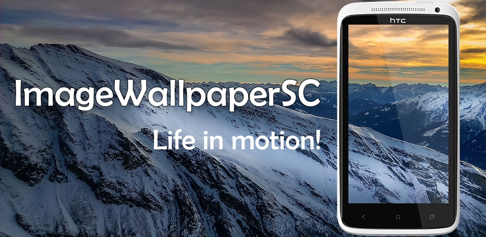

# ImageWallpaperSC

Free android LiveWallpapers. ImageWallpaperSC - live wallpaper in the style of "Slideshow". All images and videos from the selected directory will be randomly displayed on the screen and gradually scroll left and right and change smoothly. You can scroll the wallpaper with your finger left and right. Double tapping the screen changes the image.

Functions:
- Powered by OpenGL ES 2.0 and upper (if supported your device).
- Smooth animation.
- Support for pictures and videos.
- Ability to enable blur effect (for photos).

# Private Police
## Terms & Privacy

ImageWallpaperSC is a free app. This App is provided by {SCrat_ORS} at no cost and is intended for use as is.

This page is used to inform regarding our policies with the collection, use, and disclosure of information if anyone decided to use our App.

If you choose to use our App, then you agree to the collection and use of information in relation with this policy. We will not collect any personal information in this app as described in this Privacy Policy.
Personal Information

We do not collect, store or use any personal information while you install or upgrade our products.

We may use personal information submitted by you only for the following purposes: help us to develop, deliver, and improve our products and services and supply higher quality service. In the following circumstances, we may disclose your personal information according to your wish or regulations by law:

Your prior permission;
By the applicable law within or outside your country of residence, legal process, litigation requests;
By requests from public and governmental authorities
To protect our legal rights and interests.

## Non-Personal Information:

We may collect and use non-personal information in the following circumstances. To have a better understanding in user’s behavior, solve problems in products and services, improve our products, services and advertising, we may collect non-personal information such as installed application name and package name.

If non-personal information is combined with personal information, we treat the combined information as personal information for the purposes of this Privacy Policy.

## Information we get from your use of our services:

Device information: Device-specific information such as your hardware model and operating system version
Unique application numbers: Certain services include a unique application number. This number and information about your installation (for example, the operating system type and application version number)

## Android Permissions

This application does not use any permissions. To access media files, system media providers are used.

## Privacy Policy Changes:

Our Privacy Policy may change from time to time, we will post any privacy policy changes on this page, so please review it periodically.

## Contact Us:
If you have any questions about this Privacy Policy, please feel free to contact us. Email：scrators@gmail.com

## Download this app from Google Play:
https://play.google.com/store/apps/details?id=com.scrat.imagewallpapersc
